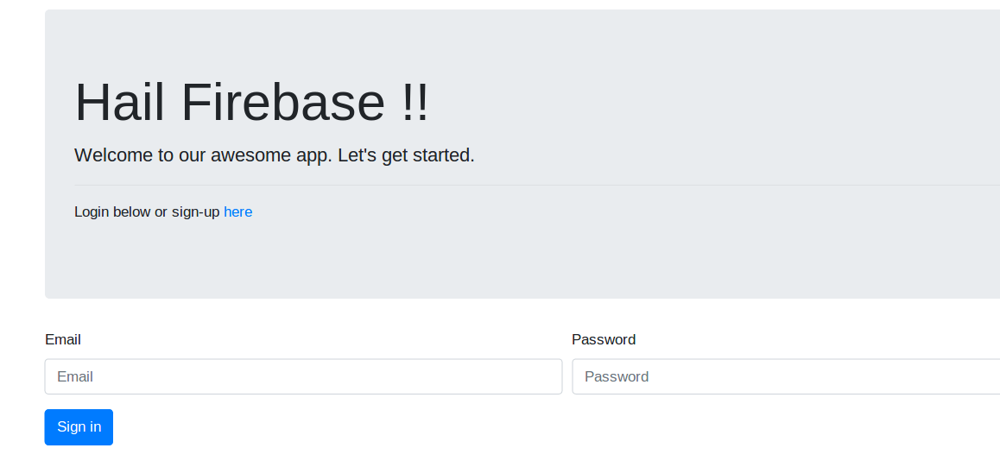
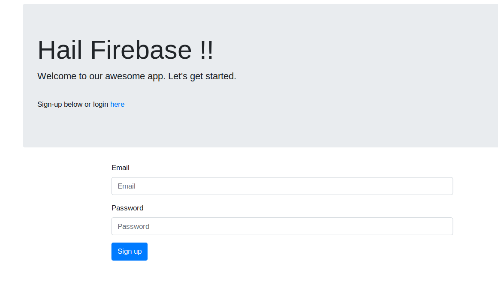
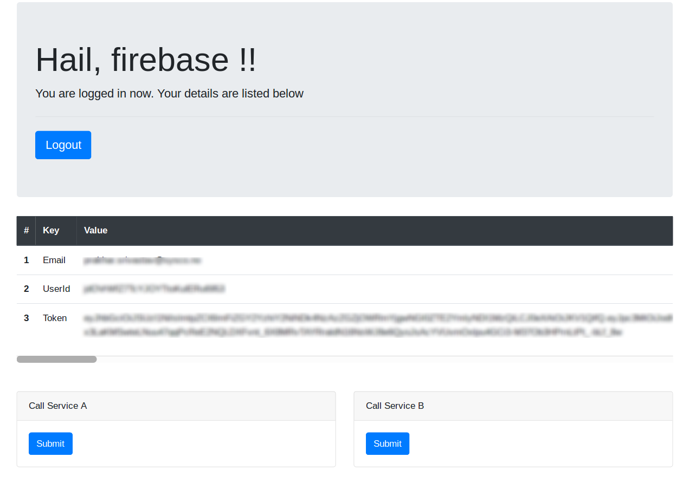

# firebase-authentication
This app demonstrates how to use firebase-authentication in a simple web-app.

Before you start, do the following
- create a firebase project.
- choose the correct pricing plan. A free spark-plan should suffice for this demo.
- create a web app in you firebase project.
- copy the firebase configuration from you firebase project and replace them in the html files under public directory
-   ```js
      // Your web app's Firebase configuration
      let firebaseConfig = {
        apiKey: "your-api-key",
        authDomain: "your-project-id.firebaseapp.com",
        databaseURL: "https://your-project-id.firebaseio.com",
        projectId: "your-project-id",
        storageBucket: "",
        messagingSenderId: "your-messaging-sender-id",
        appId: "your-app-id"
      };
      // Initialize Firebase
      firebase.initializeApp(firebaseConfig);
    ```
- download the service-account.json file from firebase. keep it safely under the root of the project as "fb.json"
- build the app `go build ./...`
- run the app `ro run main.go`
- go to index page [http://localhost:1313](http://localhost:1313)
- enter your login details if you have created account already
- else go to [signup](http://localhost:1313/signup.html) page and create an account

# screenshots
Login


Signup


Dashboard



